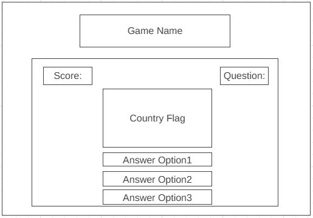
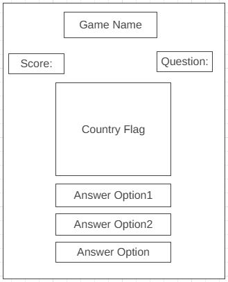
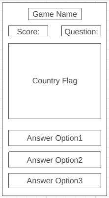
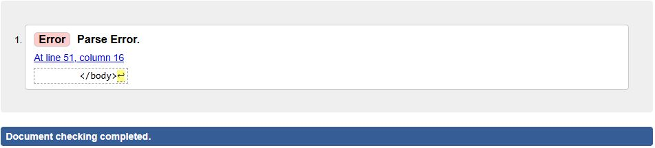
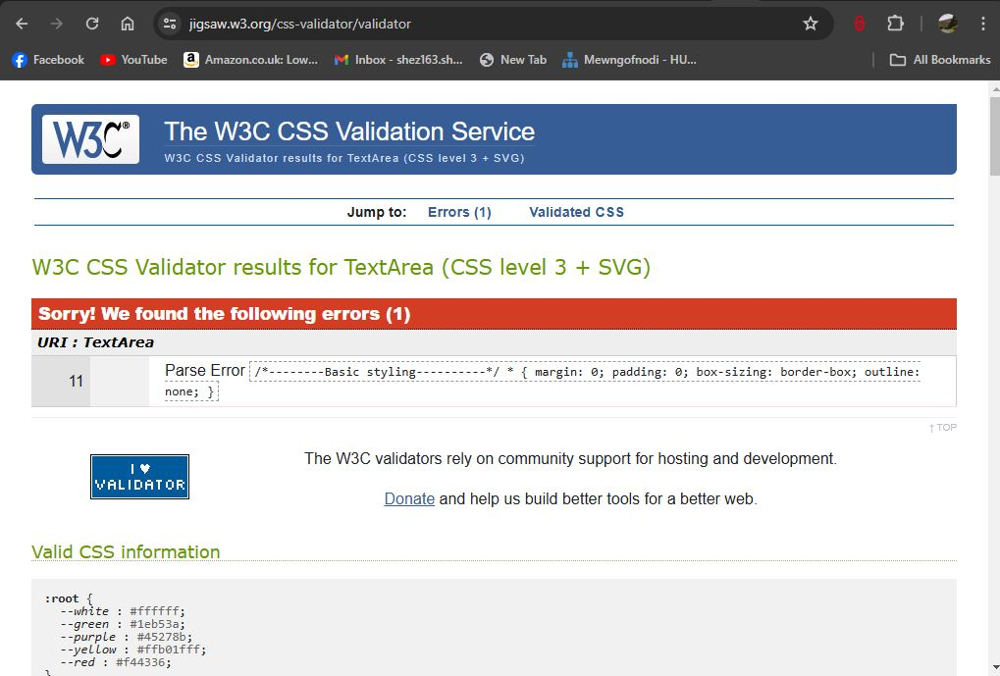
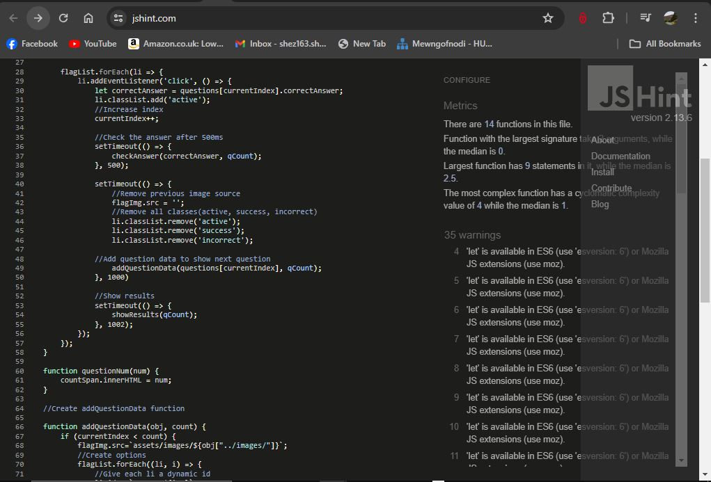
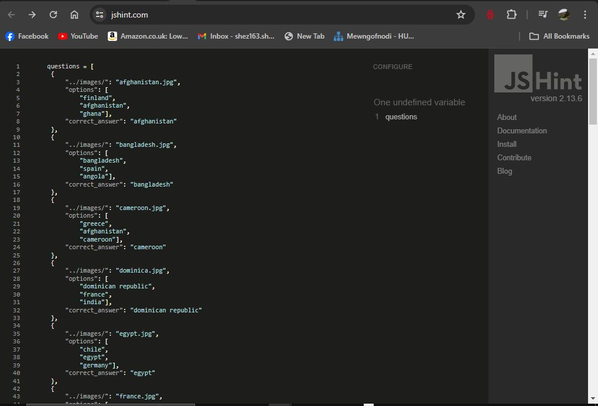

# Countries Flag

Welcome to Countries Flags Game website, this ia a quiz game that is built to educate, challenge and entertain the users. It's a game that randomly displays different country national flag with three answer options to choose from. For every correct answer, the user scores one point and there is a maximum of 20 question for every game section. So relax and play and challenge yourself to beat your top score by playing again. 

### Business Goals

The business goals for this website are:

* A well defined and structured game website with relevant information   
  and easy to understand and engage with.

* Create a positive visual appealing and navigation experience that will 
  drive frequent visit of the user to the game site.

* Increase traffic to the game site by regularly updating the game with
  more country flags to further engage the user.

# User Experience (UX)

### User Stories

This game website primary target audience are teenagers and adults, this is to help them unwind while also learning in the process. 

### User Goals

* As a first time user: 
    - I want to know what the game is about and how to play.
    - I want the game to be fun and engaging.
    - I want a visual appealing, well functioning gane site.
    - I want to see instruction on how to play the game.
    - I want to quickly and easily navigate through the game.    

* As a returning user:
    - I'd like there to be a large pool of questions available to keep 
      the game challenging and replayable..
    - I want to view my previous scores so that I may improve them.

* As a frequent user:
    - I'd like there to be a large pool of questions available to keep 
      the game challenging and replayable.
    - I want to view my previous scores so that I may improve them.

# Features

* Responsive on all devices.
* Easy to navigate using buttons throughout the site.
* Random display of country flags.
* Random display of options, with click button
* How to play modal, explaining the quizes purpose.
* A heads up display to display question count and user score.

# Future Features

To further improve users' experience of the game website, i would like to implement the following:

   * A leaderboard that saves users score to the local storage allowing 
     them to track high scores.

   * Answer choices display that congratulate the user when they get any 
     question right and a display that shows the correct answer when the user gets the answer wrong. 

   * Would like to create multiple levels in the game and increase the number of the questions currently available to the game.  

# Typography and Color Scheme

### Typography

   #### Font Style

   The primary font style used for this project is Raleway, with Sans-serif as an alternative and are both obtained from Google font. Raleway was chosen for this project because of it's compatibility with a majority of browsers. It was used for the headings, paragraph, lists and other standard text elements. It has a natural and bold feel to it, and the font weight are smooth and easy to read.

### Color Scheme

The main colors used throughout this website are:
* #45278b-purple: This color was used for the title, score and question area as well as the option buttons and hover effects.  
* #ffffff-White: This color was used as the background color for the 
  option buttons and hover text color. 
* #00000-Black: This color was used as the text-color for the How to Play 
  button. 
* #ffb01fff-Yellow: This color was used as the background color of the How 
  to Play button. 

The colors used offers a well balanced contrast. It give a rich and satisfactory feeling, the background image color is soft, cool and smooth which gives the text and images an elevated feeling that makes them stand out.    

# Wireframes

#### Home page

# Technology Used

### Languages used
  * HTML
  * CSS
  * JavaScript

  ### Programs, Frameworks and Library Used

  * Gitpod was used to write and edit all codes
  * Github was used to store all files for this project
  * [Google Fonts](https://fonts.googleapis.com/css2?family=Raleway:ital, 
    wght@0,100..900,1,100..900&display=swap" rel="stylesheet) was used to used to import the font used on the site
  * [Boxicons](https://boxicons.com/usage) was used to for all icons for 
    this website
  * [Wireframe.cc:](https://wireframe.cc/pro/pp/2dccb21c0733395#7ylf8hk2) 
    was used to create the wireframes
  * [Favicon.cc:](https://www.favicon.cc/?action=import_request) was used 
    to create favicon.
  * [UI.dev](https://ui.dev/amiresponsive?url=https://     8000-saintify13-sherify-vc4eqg5z5z8.ws-eu110.gitpod.io/)was used to show the site on a range of screen sizes. 
  * [Wikipedia](https://en.wikipedia.org/wiki/    File:A_large_blank_world_map_with_oceans_marked_in_blue.PNG) the background image used was from wikipedia. 

  ### W3C HTML Validation
   *  
  
  ### W3C CSS Validator
   * 

  ### JSHint JavaScript Quality Tool
   * 
   *  

  ### Lighthouse 
      The Chrome Developer Tools lighthouse feature was employed to assess performance, adherence to best practices, accessibility, and Search Engine Optimisation (SEO). Both desktop and mobile tests were conducted for each page.
      * 
      * 

### Bugs
    * When validating the index.html a parse error on the body closing     tag was identified, I rearrange the code and the parse error was gone.
    * When validating the the style.css code a parse error on the 
      universal selector asterisk was identified but no further action was tken.
    * when trying to view the javascript code in the browser the images 
      were not loa ding on the browser, i chrome developer tool to debug the code and found out a typo error on the file path which is causing the images not to load. I corrected the key name of the file path and then rerun the code and the issue was fixed.   

# Deployment

### Github Pages

Countries flags game website is deployed using Github Pages. The deployment was carried out in the following steps:

  1. Login to Github
  2. On the top-left corner click on the dropdown menu
  3. on the dropdown menu click on (https://saintify13.github.io/sherify/) 
     repository
  4. In the saintify13 repository click on the settings tab
  5. on the side bar, locate the Code and Automation subheading and click on 
     Pages.
  6. under Build and Deployment, locate Source section. Set the branch to 
     main and the folder to root
  7. Click on save, wait a few minutes and the website will be deployed and 
     the url displayed on the search bar
  8. Copy the url and paste it in a new tab, then you can view the life 
     website. 

  ### Fork Repository

      By forking the GitHub Repository we make a copy of the original repository on our GitHub account to view and/or make changes without affecting the original repository by using the following steps:

      * Log in to GitHub and locate the GitHub Repository
      * At the top of the Repository (not top of page) just below the "Settings" Button on the menu, locate the "Fork" Button.
      * You should now have a copy of the original repository in your      GitHub account.

  ### Clone Repository
      To clone the repository:

    * Log in to GitHub and locate the GitHub Repository.
    * Click the green "Code" button, select whether you would like to 
      clone with HTTPS, SSH or GitHub CLI and copy the link shown.
    * Open in the terminal in your code editor.
    * Change the current working directory to the location where you want the cloned directory to be made.
    * Type git clone, and then paste the URL you copied in Step 2.
    * Press enter. Your local clone has now been created.

# Credit

### Code
    * [front end with Salimi](https://www.youtube.com/watch?v=GfRgpXvqudM)
      followed his tutorial on how to create flag quiz game using html, css and javascript to design the project structure, style and logic.
    * [code Institute Love Maths walkthrough project](https://learn.codeinstitute.net/courses/course-v1:CodeInstitute+CPJS_06_20+2020_T1/courseware/8f9b28d4b7664bb59ddf18b8e090671f/b6d5c008ef4a460ba0836a224aa3b3fb/) to help understand javasript concept.

### Content
    The following resources were useful in understanding how to create flag quiz game:
    * [Salimi](https://www.youtube.com/watch?v=GfRgpXvqudM) Front end with 
      tutorial
    * [Donovanainsley](https://github.com/donovanainsley/movie-maestro?tab=readme-ov-file#languages-used) Movie Maestro
    * [Mipear](https://github.com/mipear/Merge)Merge  

### Media
  * [Boxicons](https://boxicons.com/usage) was used to for all icons for 
    this website
  * [Wireframe.cc:](https://wireframe.cc/pro/pp/2dccb21c0733395#7ylf8hk2) 
    was used to create the wireframes
  * [Favicon.cc:](https://www.favicon.cc/?action=import_request) was used 
    to create favicon.
  * [UI.dev](https://ui.dev/amiresponsive?url=https://     8000-saintify13-sherify-vc4eqg5z5z8.ws-eu110.gitpod.io/)was used to show the site on a range of screen sizes. 
  * [Wikipedia](https://en.wikipedia.org/wiki/    File:A_large_blank_world_map_with_oceans_marked_in_blue.PNG) the background image used was from wikipedia.  

### Acknowledgement
    I want to say a big thank you to the following persons who have supported me during the course of this project
    * Rohit Sharma - My Mentor, for guiding me through this project and 
      his consistence support whenever i call on him. 
    * Amy_ci - Cohort, for her advice, encouragement and assistance.
    * Sarah_ci - Tutor support, for helping me sortout my codes
    * Sheryl Osuagwu - My lovely Wife, for her morale support and believe in me.      